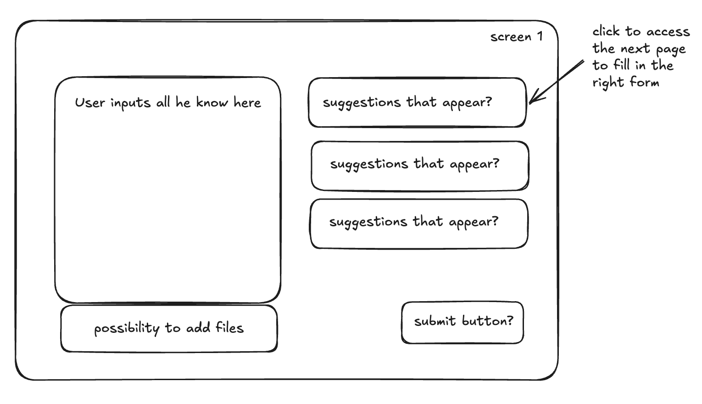
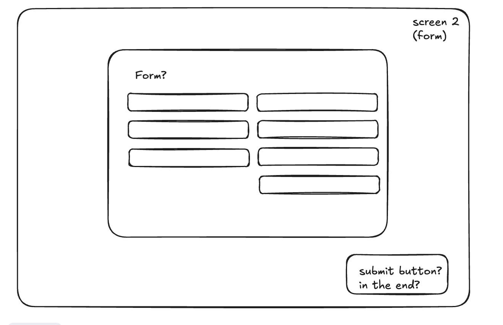

## TODO

1. webpage frame 1 - user input (below)
   

2. webpage frame 2 - first form
   

## If you need to run client(frontend)

1. npm start
2. or `cd ..` (to folder auxilium) and `npm run client`
